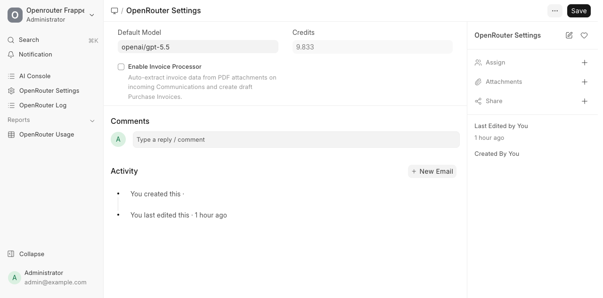
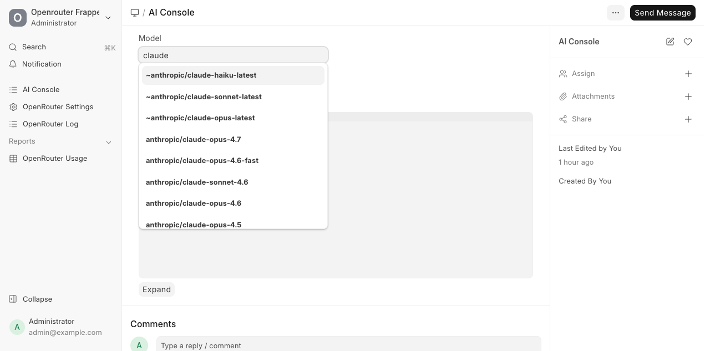

> **Note:** This README was generated by [Claude Code](https://claude.com/claude-code).

## Openrouter Frappe

A Frappe app that connects your site to [OpenRouter](https://openrouter.ai/) so you can use any LLM (Claude, GPT, Gemini, Llama, ...) from inside Frappe — with usage logging, cost tracking, and a couple of ready-to-use features.

## Install

```bash
cd $PATH_TO_YOUR_BENCH
bench get-app https://github.com/buildwithhussain/openrouter_frappe --branch develop
bench install-app openrouter_frappe
```

## Set your OpenRouter API key

The app reads the API key from your **site config** (preferred) or the `OPENROUTER_API_KEY` environment variable. The site config is the easiest way:

```bash
bench --site your-site.localhost set-config OPENROUTER_API_KEY sk-or-v1-xxxxxxxxxxxxxxxxxxxxxxxx
```

That writes the key to `sites/your-site.localhost/site_config.json` like this:

```json
{
  "db_name": "...",
  "OPENROUTER_API_KEY": "sk-or-v1-xxxxxxxxxxxxxxxxxxxxxxxx"
}
```

You can also export it as an environment variable instead:

```bash
export OPENROUTER_API_KEY=sk-or-v1-xxxxxxxxxxxxxxxxxxxxxxxx
```

Get your key from [openrouter.ai/keys](https://openrouter.ai/keys).

## Pick a default model

Open **OpenRouter Settings** in the desk (or visit `/app/openrouter-settings`) and pick a **Default Model** from the autocomplete — it's populated live from OpenRouter's catalog. Anything you use that doesn't specify a model falls back to this.

The page also shows your remaining **Credits** and the toggle for the Invoice Processor.



## Features

### AI Console

A scratchpad to chat with any model. Visit `/app/ai-console`:

- **Model** — autocomplete to switch between models on the fly. Leave blank to use the default from settings. Great for comparing how different models answer the same prompt.
- **Message** — your prompt.
- **Send Message** — sends and shows the reply in **Output**.



Every call is logged in **OpenRouter Log** with token counts, cost, latency and provider — so you can see exactly what each experiment cost.

### Invoice Processor

When enabled, every incoming `Communication` (e.g. an email that lands in your Frappe inbox) with a PDF attachment is sent to the LLM. If the PDF looks like an invoice, a draft **Purchase Invoice** is created automatically. Anything that isn't an invoice is ignored.

To turn it on, tick **Enable Invoice Processor** in OpenRouter Settings:

- Off by default — nothing runs until you opt in.
- Uses your **Default Model** for the extraction.
- Errors and non-invoice replies are skipped silently; failures show up in the Error Log under "Invoice Processor".

### Usage report

The **OpenRouter Usage** report (under Reports) gives you a breakdown of tokens and cost per model / day, pulled from the logs.

## License

MIT
